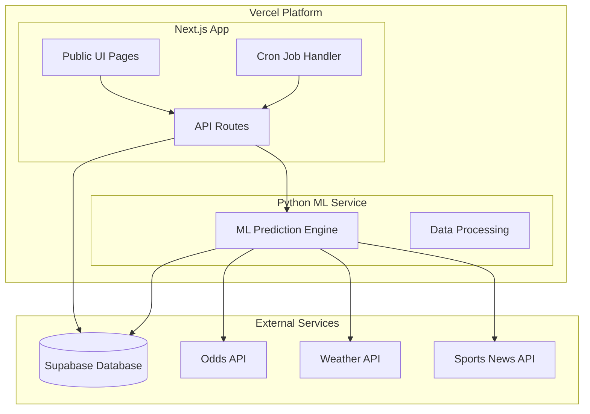

# Design Document

## Overview

DailyBet AI is a public web application built with Next.js (App Router) and deployed on Vercel. The system provides a single ML-powered betting recommendation daily, automatically generated through a scheduled cron job. The architecture emphasizes simplicity, reliability, and cost-effectiveness while delivering accurate betting insights through machine learning analysis.

## Architecture

### High-Level Architecture



### Technology Stack

- **Frontend**: Next.js 14 with App Router, TypeScript, Tailwind CSS
- **Backend**: Next.js API Routes, Python serverless functions
- **Database**: Supabase (PostgreSQL with real-time capabilities)
- **ML Framework**: XGBoost/LightGBM with pandas/numpy
- **Deployment**: Vercel with cron scheduling
- **Styling**: Tailwind CSS with responsive design
- **Charts**: Recharts for performance visualization

## Components and Interfaces

### Frontend Components

#### 1. Home Page (`/`)
- **Purpose**: Display today's betting recommendation
- **Components**:
  - `BetCard`: Shows pick details (team, market, odds, confidence)
  - `PerformanceOverview`: Current win rate and record summary
  - `RationaleSection`: ML reasoning explanation
- **Data Flow**: Fetches from `/api/today` on page load

#### 2. Performance Page (`/performance`)
- **Purpose**: Historical algorithm performance tracking
- **Components**:
  - `PerformanceStats`: Win rate, total picks, streaks
  - `HistoryTable`: Past picks with outcomes
  - `WinRateChart`: Visual trend over time
- **Data Flow**: Fetches from `/api/performance` with pagination

#### 3. Layout Components
- `Header`: Navigation and branding
- `Footer`: Links and information
- `LoadingSpinner`: Consistent loading states
- `ErrorBoundary`: Graceful error handling

### API Endpoints

#### Public Endpoints

**GET /api/today**
```typescript
interface TodayResponse {
  pick: {
    id: string;
    date: string;
    league: string;
    market: string;
    selection: string;
    odds: number;
    confidence: number;
    rationale: {
      topFactors: string[];
      reasoning: string;
    };
  } | null;
  performance: {
    winRate: number;
    record: string;
    totalPicks: number;
  };
}
```

**GET /api/performance**
```typescript
interface PerformanceResponse {
  stats: {
    winRate: number;
    totalPicks: number;
    wins: number;
    losses: number;
    pushes: number;
    currentStreak: { type: 'win' | 'loss'; count: number };
  };
  history: Array<{
    id: string;
    date: string;
    selection: string;
    odds: number;
    confidence: number;
    result: 'win' | 'loss' | 'push' | null;
    settledAt: string | null;
  }>;
  chartData: Array<{
    date: string;
    winRate: number;
    cumulativeWins: number;
    cumulativeLosses: number;
  }>;
}
```

#### Protected Endpoints

**POST /api/jobs/daily-pick** (Cron only)
- Validates cron secret token
- Triggers ML analysis for today's games
- Stores generated pick in database

**POST /api/admin/settle** (Admin only)
```typescript
interface SettleRequest {
  pickId: string;
  result: 'win' | 'loss' | 'push';
}
```

**POST /api/admin/recompute** (Admin only)
- Manually triggers ML recomputation
- Useful for debugging and model updates

### Python ML Service

#### ML Endpoint: `/api/ml/pick`

**Input Interface**:
```python
class MLRequest(BaseModel):
    date: str
    games: List[Game]
    context: Dict[str, Any]

class Game(BaseModel):
    home_team: str
    away_team: str
    league: str
    start_time: str
    odds: Dict[str, float]  # moneyline odds
```

**Output Interface**:
```python
class MLResponse(BaseModel):
    selection: str
    market: str
    league: str
    odds: float
    confidence: float
    rationale: Dict[str, Any]
    features_used: List[str]
```

#### ML Pipeline Architecture

1. **Data Ingestion Layer**
   - Odds API integration with line movement tracking
   - Weather data with sport-specific impact modeling
   - Advanced team statistics (offensive/defensive efficiency)
   - Injury reports with position-specific impact analysis
   - Schedule data for rest/travel calculations
   - Historical matchup and situational data

2. **Feature Engineering**
   - **Team Performance Features**: Offensive rating, defensive rating, net rating, pace-adjusted metrics
   - **Situational Features**: Rest days, travel distance, time zone changes, home/away splits
   - **Contextual Features**: Weather impact by sport, venue-specific factors, altitude adjustments
   - **Advanced Analytics**: Clutch performance, strength of schedule, recent form with opponent adjustments
   - **Market Features**: Line movement analysis, market efficiency, sharp vs public money
   - **Injury Impact**: Position-weighted injury analysis, replacement player quality assessment

3. **Model Layer**
   - **Ensemble Approach**: Combines XGBoost, Random Forest, and Neural Network predictions
   - **Specialized Models**: Separate models for different sports and situations
   - **Feature Importance**: Dynamic feature weighting based on data quality and relevance
   - **Confidence Calibration**: Platt scaling for accurate probability estimates
   - **Expected Value Optimization**: Kelly criterion for optimal bet sizing recommendations

4. **Selection Logic**
   - Multi-criteria decision analysis considering EV, confidence, and risk
   - Dynamic threshold adjustment based on market conditions
   - Portfolio optimization when multiple strong picks exist
   - Risk management with maximum exposure limits
   - Detailed rationale generation with factor attribution

## Data Models

### Database Schema (Supabase)

```sql
-- Picks table: stores daily ML recommendations
CREATE TABLE picks (
    id UUID PRIMARY KEY DEFAULT gen_random_uuid(),
    pick_date DATE NOT NULL UNIQUE,
    league TEXT NOT NULL,
    home_team TEXT NOT NULL,
    away_team TEXT NOT NULL,
    market TEXT NOT NULL DEFAULT 'moneyline',
    selection TEXT NOT NULL,
    odds NUMERIC(5,2) NOT NULL,
    confidence NUMERIC(3,1) NOT NULL CHECK (confidence >= 0 AND confidence <= 100),
    rationale JSONB NOT NULL,
    features_used JSONB,
    created_at TIMESTAMPTZ DEFAULT NOW(),
    updated_at TIMESTAMPTZ DEFAULT NOW()
);

-- Results table: tracks pick outcomes
CREATE TABLE results (
    id UUID PRIMARY KEY DEFAULT gen_random_uuid(),
    pick_id UUID NOT NULL REFERENCES picks(id) ON DELETE CASCADE,
    result TEXT NOT NULL CHECK (result IN ('win', 'loss', 'push')),
    settled_at TIMESTAMPTZ DEFAULT NOW(),
    notes TEXT
);

-- Performance view: aggregated statistics
CREATE VIEW v_performance AS
SELECT 
    COUNT(*) as total_picks,
    COUNT(CASE WHEN r.result = 'win' THEN 1 END) as wins,
    COUNT(CASE WHEN r.result = 'loss' THEN 1 END) as losses,
    COUNT(CASE WHEN r.result = 'push' THEN 1 END) as pushes,
    ROUND(
        COUNT(CASE WHEN r.result = 'win' THEN 1 END)::NUMERIC / 
        NULLIF(COUNT(CASE WHEN r.result IN ('win', 'loss') THEN 1 END), 0) * 100, 
        1
    ) as win_rate
FROM picks p
LEFT JOIN results r ON p.id = r.pick_id
WHERE r.result IS NOT NULL;

-- Indexes for performance
CREATE INDEX idx_picks_date ON picks(pick_date DESC);
CREATE INDEX idx_results_pick_id ON results(pick_id);
CREATE INDEX idx_results_settled_at ON results(settled_at DESC);
```

### TypeScript Types

```typescript
// Generated from Supabase
export interface Database {
  public: {
    Tables: {
      picks: {
        Row: {
          id: string;
          pick_date: string;
          league: string;
          home_team: string;
          away_team: string;
          market: string;
          selection: string;
          odds: number;
          confidence: number;
          rationale: Json;
          features_used: Json | null;
          created_at: string;
          updated_at: string;
        };
        Insert: {
          pick_date: string;
          league: string;
          home_team: string;
          away_team: string;
          selection: string;
          odds: number;
          confidence: number;
          rationale: Json;
          market?: string;
          features_used?: Json;
        };
      };
      results: {
        Row: {
          id: string;
          pick_id: string;
          result: 'win' | 'loss' | 'push';
          settled_at: string;
          notes: string | null;
        };
        Insert: {
          pick_id: string;
          result: 'win' | 'loss' | 'push';
          notes?: string;
        };
      };
    };
  };
}
```

## Error Handling

### Frontend Error Handling

1. **API Error States**
   - Network failures: Show retry button with exponential backoff
   - No data available: Display helpful messaging
   - Loading states: Skeleton components during data fetching

2. **Component Error Boundaries**
   - Catch React errors and display fallback UI
   - Log errors for debugging
   - Graceful degradation for non-critical features

### Backend Error Handling

1. **API Route Error Responses**
   ```typescript
   interface ErrorResponse {
     error: string;
     code: string;
     details?: any;
   }
   ```

2. **ML Service Error Handling**
   - Timeout handling for external API calls
   - Fallback to simpler models if primary fails
   - Graceful degradation with reduced confidence

3. **Database Error Handling**
   - Connection retry logic
   - Transaction rollback on failures
   - Detailed error logging

### Monitoring and Logging

1. **Application Logging**
   - Structured logging with timestamps
   - Error tracking with stack traces
   - Performance metrics for API endpoints

2. **ML Pipeline Monitoring**
   - Feature availability tracking
   - Model performance metrics
   - Data quality validation

## Testing Strategy

### Unit Testing

1. **Frontend Components**
   - React Testing Library for component behavior
   - Mock API responses for data fetching
   - Accessibility testing with jest-axe

2. **API Routes**
   - Request/response validation
   - Error condition testing
   - Authentication and authorization

3. **ML Service**
   - Feature engineering validation
   - Model output consistency
   - Edge case handling

### Integration Testing

1. **API Integration**
   - End-to-end API workflow testing
   - Database integration validation
   - External service mocking

2. **Cron Job Testing**
   - Scheduled execution simulation
   - Error recovery testing
   - Data consistency validation

### Performance Testing

1. **Load Testing**
   - API endpoint performance under load
   - Database query optimization
   - Caching strategy validation

2. **ML Performance**
   - Inference time measurement
   - Memory usage optimization
   - Cold start mitigation

## Deployment and Configuration

### Vercel Configuration

```json
{
  "crons": [
    {
      "path": "/api/jobs/daily-pick",
      "schedule": "0 15 * * *"
    }
  ],
  "regions": ["iad1"],
  "functions": {
    "app/api/ml/pick.py": {
      "maxDuration": 30
    }
  }
}
```

### Environment Variables

```bash
# Supabase Configuration
NEXT_PUBLIC_SUPABASE_URL=your_supabase_url
NEXT_PUBLIC_SUPABASE_ANON_KEY=your_anon_key
SUPABASE_SERVICE_ROLE_KEY=your_service_role_key

# Cron Security
CRON_SECRET=your_cron_secret

# External APIs
ODDS_API_KEY=your_odds_api_key
WEATHER_API_KEY=your_weather_api_key

# Admin Configuration
ADMIN_SECRET=your_admin_secret
```

### Security Considerations

1. **API Security**
   - Rate limiting on public endpoints
   - Input validation and sanitization
   - CORS configuration for public access

2. **Cron Security**
   - Secret token validation
   - IP allowlist for Vercel cron
   - Request logging and monitoring

3. **Data Security**
   - No PII collection (public site)
   - Secure API key management
   - Database connection encryption